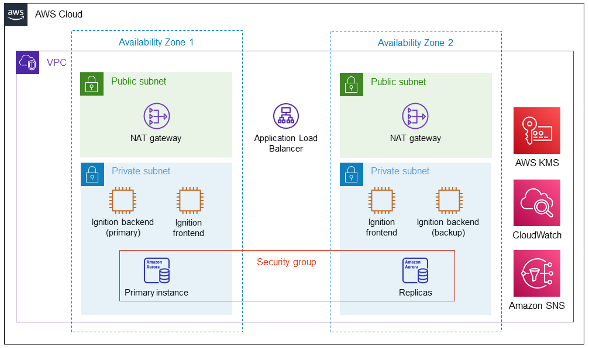

:xrefstyle: short

This Quick Start provides two ways to deploy Ignition, standalone or cluster.

[[standalone]]
=== Standalone

This option deploys a redundant pair of Ignition servers that are publicly available. Deploying this Quick Start with default parameters builds the following Ignition environment in the AWS Cloud.

[#architecture_standalone]
.Quick Start architecture for {partner-product-short-name} on AWS

As shown in <<architecture_standalone>>, this Quick Start sets up the following:

* A highly available architecture that spans two Availability Zones.*
* A virtual private cloud (VPC) configured with public and private subnets, according to AWS best practices, to provide you with your own virtual network on AWS.*
* In the public subnets:
** Managed network address translation (NAT) gateways to allow outbound internet access for resources in the private subnets.*
** An optional Linux bastion host in an Auto Scaling group to allow inbound Secure Shell (SSH) access to Amazon EC2 instances and Aurora database in the private subnets.*
** A primary Ignition server in availability zone 1.
** A backup Ignition server in availability zone 2.
* In the private subnets:
** An Aurora DB cluster that includes two DB readers and one DB writer.
** An encryption key using AWS Key Management Service (AWS KMS). The Quick Start uses the key to enable encryption at rest for the Aurora DB cluster.
** An Amazon CloudWatch alarm to monitor the CPU on the bastion host and send an Amazon Simple Notification Service (Amazon SNS) notification when the alarm is triggered.

[.small]#* The template that deploys this Quick Start into an existing VPC skips the components marked by asterisks and prompts you for your existing VPC configuration.#

[[cluster]]
=== Cluster

This option deploys Ignition in a scale-out architecture. You will get a redundant pair of Ignition backend (I/O) servers and 2 frontend servers behind a load balancer. Deploying this Quick Start with default parameters builds the following Ignition environment in the AWS Cloud.

[#architecture_cluster]
.Quick Start architecture for {partner-product-short-name} on AWS

As shown in <<architecture_cluster>>, this Quick Start sets up the following:

* A highly available architecture that spans two Availability Zones.*
* A virtual private cloud (VPC) configured with public and private subnets, according to AWS best practices, to provide you with your own virtual network on AWS.*
* In the public subnets:
** Managed network address translation (NAT) gateways to allow outbound internet access for resources in the private subnets.*
** An optional AWS Client VPN to allow direct access to Amazon EC2 instances and Aurora database in the private subnets.*
** An elastic load balancer (ELB) configured with an Amazon SSL certificate and both frontend servers in the target group. 
* In the private subnets:
** An Aurora DB cluster that includes two DB readers and one DB writer.
** An encryption key using AWS Key Management Service (AWS KMS). The Quick Start uses the key to enable encryption at rest for the Aurora DB cluster.
** An Amazon CloudWatch alarm to monitor the CPU on the bastion host and send an Amazon Simple Notification Service (Amazon SNS) notification when the alarm is triggered.
** A primary Ignition backend server in availability zone 1.
** A backup Ignition backend server in availability zone 2.
** A frontend Ignition server in availability zone 1.
** A frontend Ignition server in availability zone 2.

[.small]#* The template that deploys this Quick Start into an existing VPC skips the components marked by asterisks and prompts you for your existing VPC configuration.#
